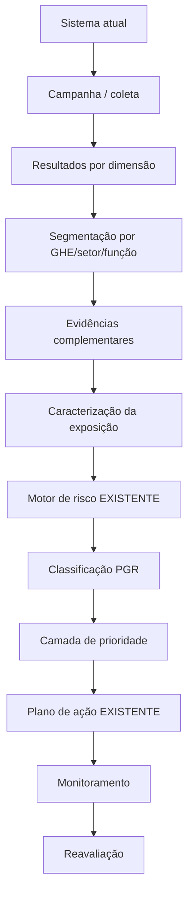

# ADEQUAÇÃO DO MOTOR EXISTENTE — CLASSIFICAÇÃO DE RISCOS PSICOSSOCIAIS NO PGR

> Documento de orientação para o Cursor.
>
> **Contexto obrigatório:** já existe um sistema em funcionamento e já existe um motor de avaliação/classificação de riscos.
>
> **Objetivo deste documento:** NÃO reconstruir o sistema, NÃO substituir o motor existente e NÃO criar uma metodologia paralela. O Cursor deve primeiro inspecionar a implementação atual, entender como os dados entram, como a exposição é caracterizada, como severidade/probabilidade são calculadas e como o risco chega ao PGR. Depois, deve comparar o que existe com as práticas úteis extraídas do material **"Fatores de Riscos Psicossociais na Prática"** e incorporar somente melhorias compatíveis e tecnicamente justificadas.

---

# 1. REGRA PRINCIPAL PARA O CURSOR

Antes de alterar qualquer código:

```text
1. LEIA A IMPLEMENTAÇÃO ATUAL.
2. IDENTIFIQUE O MOTOR DE RISCO EXISTENTE.
3. IDENTIFIQUE A MATRIZ EXISTENTE.
4. IDENTIFIQUE COMO O SISTEMA TRATA:
   - GHE/setor/função;
   - fatores psicossociais;
   - questionários;
   - evidências;
   - exposição;
   - severidade;
   - probabilidade;
   - classificação;
   - prioridade;
   - plano de ação;
   - PGR.
5. NÃO DUPLIQUE CONCEITOS.
6. NÃO CRIE UMA NOVA MATRIZ se já houver matriz institucional.
7. NÃO ALTERE RESULTADOS HISTÓRICOS.
8. APONTE primeiro o que pode ser aproveitado.
9. SÓ DEPOIS proponha alterações.
```

---

# 2. O QUE ESTE MATERIAL PODE AGREGAR AO MOTOR EXISTENTE

O material traz boas práticas principalmente em cinco pontos:

```text
A. identificação estruturada;
B. análise segmentada por grupo;
C. interpretação além do score bruto;
D. diferenciação entre risco e prioridade de intervenção;
E. transformação do resultado em ação.
```

Esses pontos devem ser usados como **camada de melhoria**, não como substituição automática da metodologia já existente.

---

# 3. NÃO TRATAR O E-BOOK COMO NORMA

O material é uma referência prática.

Portanto:

```text
NÃO:
"Segundo a NR-1, deve-se usar COPSOQ."

NÃO:
"A NR-1 determina esta matriz Alto/Médio/Baixo."

NÃO:
"75% de respostas desfavoráveis = risco alto por determinação legal."
```

Usar:

```text
"O material analisado apresenta esta prática como referência."

"A metodologia institucional continua sendo a definida pelo sistema/empresa,
desde que tecnicamente documentada e compatível com o PGR."
```

---

# 4. PRIMEIRO PASSO — AUDITORIA DO MOTOR EXISTENTE

O Cursor deve localizar:

```text
risk_engine
risk_matrix
psychosocial_engine
assessment_engine
severity
probability
exposure
priority
pgr
inventory
ghe
campaign
questionnaire
score
```

ou equivalentes existentes no projeto.

Gerar antes de qualquer alteração um diagnóstico:

```markdown
## Diagnóstico da implementação atual

### Motor localizado em
- arquivo:
- serviço:
- função principal:

### Entrada
- dados utilizados:

### Saída
- classificação produzida:

### Matriz
- critérios:

### Tratamento psicossocial atual
- funcionamento:

### Pontos já atendidos
- ...

### Lacunas reais
- ...

### Mudanças recomendadas
- ...

### Itens do e-book que NÃO precisam ser implementados
- ...
```

---

# 5. NÃO SUBSTITUIR A MATRIZ EXISTENTE DO PGR

Se o sistema já possui:

```text
SEVERIDADE x PROBABILIDADE = NÍVEL DE RISCO
```

manter esta estrutura.

O e-book possui uma matriz prática de priorização baseada em:

- gravidade;
- frequência;
- facilidade/complexidade de solução.

Isso **não deve substituir** a matriz institucional de classificação do risco.

Arquitetura recomendada:

```text
CAMADA 1
CLASSIFICAÇÃO DO RISCO OCUPACIONAL

Severidade
    x
Probabilidade
    =
Nível de risco do PGR


CAMADA 2
PRIORIDADE DE INTERVENÇÃO

Abrangência
+ Frequência
+ Criticidade
+ Complexidade/facilidade de tratamento
+ Outros critérios institucionais
    =
Prioridade de ação
```

---

# 6. RISCO E PRIORIDADE NÃO SÃO A MESMA COISA

Implementar ou preservar esta separação:

```yaml
risk:
  severity:
  probability:
  level:
  classification:

action_priority:
  priority:
  rationale:
  urgency:
  scope:
  treatment_complexity:
```

## Regra crítica

```text
FACILIDADE DE SOLUÇÃO NÃO REDUZ O NÍVEL DO RISCO.
```

Exemplo:

```text
Risco Alto
+
Solução simples
=
Risco continua Alto
e pode receber prioridade imediata.
```

---

# 7. QUESTIONÁRIO É EVIDÊNCIA, NÃO RESULTADO FINAL DO PGR

Se o sistema já possui questionário:

não alterar para uma lógica direta:

```text
score = classificação final
```

sem verificar como o motor existente foi desenhado.

Preferir:

```text
QUESTIONÁRIO
    ↓
indicador por dimensão
    ↓
evidência
    ↓
caracterização da exposição
    ↓
validação/análise
    ↓
motor de risco
    ↓
classificação no PGR
```

---

# 8. APROVEITAR RESULTADOS POR DIMENSÃO

O material trabalha com dimensões como:

- demanda;
- controle/autonomia;
- suporte;
- reconhecimento;
- clareza de papel;
- insegurança;
- relações interpessoais;
- equilíbrio trabalho-vida;
- jornada.

Se o sistema já possui taxonomia própria:

```text
NÃO trocar os nomes automaticamente.
```

Criar, se necessário, uma camada de mapeamento:

```yaml
factor_mapping:
  external_dimension:
  internal_factor_id:
  internal_factor_name:
  mapping_confidence:
  reviewed_by:
```

---

# 9. SEGMENTAÇÃO POR GRUPO

Uma melhoria útil do material é interpretar resultados por:

- setor;
- função;
- unidade;
- hierarquia;
- grupo de trabalhadores.

No sistema, priorizar o agrupamento já utilizado pelo PGR:

```text
GHE
GES
setor
função
grupo equivalente
```

Se houver GHE, ele deve continuar sendo a referência principal quando aplicável.

---

# 10. NÃO USAR RESULTADO GLOBAL PARA PREENCHER TODOS OS GHES

Proibido:

```text
Empresa = risco alto
↓
copiar "risco alto" para todos os GHEs
```

Correto:

```text
resultado geral
    ↓
identificar grupos
    ↓
analisar evidências específicas
    ↓
classificar cada grupo quando houver dados suficientes
```

---

# 11. INTERPRETAR ALÉM DA MÉDIA

O material alerta que médias ou percentuais isolados não são suficientes.

O motor pode ser enriquecido com:

```yaml
analysis_context:
  unfavorable_percentage:
  favorable_percentage:
  neutral_percentage:
  distribution:
  trend:
  comparison_with_company:
  comparison_with_previous_cycle:
  evidence_count:
```

Não usar somente:

```yaml
average_score: 3.7
```

como conclusão.

---

# 12. PADRÕES QUE DEVEM SER PROCURADOS

Se ainda não existir, o sistema pode produzir indicadores de apoio:

```text
- concentração do problema em um GHE;
- problema sistêmico em vários GHES;
- diferenças relevantes entre funções;
- diferenças entre liderança e operação;
- deterioração entre ciclos;
- melhora entre ciclos;
- fatores de proteção;
- combinação de fatores críticos.
```

Esses indicadores não devem alterar o risco automaticamente sem regra documentada.

---

# 13. FATORES DE PROTEÇÃO

O e-book também considera elementos protetores.

Se for compatível com o sistema, incluir:

```yaml
protective_factors:
  autonomy:
  support:
  recognition:
  role_clarity:
  leadership_quality:
```

Uso:

```text
contextualizar a exposição
e
subsidiar avaliação da eficácia das medidas.
```

Não usar fator de proteção para apagar uma exposição claramente existente.

---

# 14. CARACTERIZAÇÃO DO PERIGO PARA O PGR

O resultado psicossocial deve virar registro técnico útil.

Estrutura mínima recomendada:

```yaml
psychosocial_pgr_record:
  factor:
  hazard_description:
  source_or_circumstance:
  exposed_group:
  real_work_context:
  exposure_frequency:
  exposure_duration:
  exposure_intensity:
  existing_controls:
  possible_harm:
  evidence:
  severity:
  probability:
  risk_level:
  risk_classification:
  action_priority:
  technical_rationale:
```

---

# 15. NÃO ACEITAR TEXTO GENÉRICO

Bloquear ou sinalizar:

```text
Fonte: rotina de trabalho.
Causa: trabalho.
Exposição: frequente.
Agente: risco psicossocial.
```

O motor deve buscar contexto real.

Exemplo:

```text
Fator:
Excesso de demandas.

Fonte/circunstância:
Volume diário de ordens superior à capacidade do efetivo,
prazos reduzidos e concentração de demandas no fechamento mensal.

Grupo:
GHE Expedição.

Exposição:
Recorrente durante a jornada, com intensificação nos períodos de pico.
```

---

# 16. TRABALHO REAL

O material destaca a diferença entre trabalho prescrito e trabalho real.

Verificar se o sistema já possui:

```yaml
prescribed_work:
real_work:
```

Se não possuir, considerar adicionar apenas se isso se encaixar no modelo atual.

Campos úteis:

```yaml
work_context:
  prescribed_activity:
  actual_activity:
  constraints:
  adaptations:
  workload_peaks:
  conflicting_demands:
```

---

# 17. FREQUÊNCIA COMO EVIDÊNCIA DE PROBABILIDADE

O e-book utiliza frequência na priorização:

```text
repetido/constante
ocasional
isolado/raro
```

Se o motor já possui frequência dentro da probabilidade:

**reutilizar o campo existente**.

Não criar outro campo duplicado.

Pode ser útil mapear:

```text
CONSTANTE
FREQUENTE
OCASIONAL
RARA
```

para a escala já usada pelo sistema.

---

# 18. ABRANGÊNCIA

O material também sugere considerar quantas pessoas/grupos são afetados.

Se não existir, incluir como indicador auxiliar:

```yaml
scope:
  exposed_workers:
  group_size:
  affected_percentage:
  affected_groups:
```

Abrangência pode ajudar na prioridade.

Não deve substituir severidade individual do dano possível.

---

# 19. PERCENTUAL DE RESPOSTAS DESFAVORÁVEIS

O sistema pode registrar:

```yaml
unfavorable_result:
  count:
  percentage:
  sample_size:
```

Mas não criar regra universal:

```pseudo
if percentage >= 75:
    risk = HIGH
```

O exemplo de 75% do e-book é ilustrativo, não uma tabela normativa universal.

---

# 20. COMBINAÇÕES CRÍTICAS

O JCQ apresentado no material trabalha com:

```text
alta demanda
+
baixo controle
+
baixo suporte
```

como combinação de maior preocupação.

Se o motor já trabalha com dimensões semelhantes, pode-se adicionar um **alerta contextual**, não necessariamente mudar a matriz.

Exemplo:

```yaml
pattern_alert:
  type: HIGH_DEMAND_LOW_CONTROL_LOW_SUPPORT
  triggered: true
  message: >
    Combinação de indicadores que merece análise técnica prioritária.
```

---

# 21. NÃO TRANSFORMAR ALERTA EM DIAGNÓSTICO

Nunca:

```text
"Trabalhadores apresentam burnout."
```

Usar:

```text
"Foi identificada combinação desfavorável de demanda,
controle e suporte, que requer análise das condições de trabalho."
```

---

# 22. EVIDÊNCIAS COMPLEMENTARES

O e-book recomenda combinar instrumentos com:

- entrevistas;
- grupos focais;
- observações;
- indicadores organizacionais.

Se o sistema já possui módulo de evidência, apenas integrar.

Caso contrário, avaliar inclusão de:

```yaml
evidence:
  type:
  source:
  date:
  group:
  summary:
  reliability:
```

---

# 23. INDICADORES ORGANIZACIONAIS

Podem servir como evidência complementar:

- absenteísmo;
- turnover;
- afastamentos;
- horas extras;
- pausas;
- denúncias;
- conflitos registrados;
- mudanças organizacionais.

## Cuidado

Não transformar correlação em causalidade.

Exemplo:

```text
"Aumento de turnover é indicador complementar."
```

Não:

```text
"O risco psicossocial causou o turnover."
```

sem evidência suficiente.

---

# 24. PLANO DE AÇÃO

Se já existe módulo de plano de ação, não criar outro.

O material pode enriquecer a biblioteca de medidas.

Exemplos:

### Excesso de demandas

- revisar metas;
- revisar prazo;
- redistribuir carga;
- adequar efetivo;
- rever prioridades.

### Baixa autonomia

- rever processo decisório;
- ampliar autonomia compatível;
- envolver equipe em decisões do trabalho.

### Falta de clareza

- revisar descrição de função;
- alinhar responsabilidade;
- melhorar comunicação de expectativas.

### Conflitos

- processo de mediação;
- canais de escuta;
- treinamento gerencial;
- revisão de práticas de liderança.

### Jornada

- controlar horas extras;
- garantir pausas;
- revisar dimensionamento.

---

# 25. NÃO SUGERIR APENAS MEDIDAS INDIVIDUAIS

Evitar como tratamento único:

```text
palestra
mindfulness
resiliência
ginástica
apoio psicológico
```

quando a fonte do risco é organizacional.

Priorizar:

```text
mudança na fonte/circunstância
↓
organização do trabalho
↓
processos
↓
gestão
↓
medidas complementares
```

---

# 26. RESPONSÁVEL E PRAZO

Toda ação deve manter:

```yaml
action:
  responsible:
  deadline:
  status:
  evidence:
  effectiveness_criteria:
```

Se isso já existe, apenas verificar se riscos psicossociais passam pelo mesmo fluxo.

---

# 27. REAVALIAÇÃO

O material propõe avaliações periódicas.

Não codificar automaticamente:

```text
a cada 6 meses
```

ou:

```text
anualmente
```

como obrigação universal.

Utilizar a periodicidade já definida no sistema ou parametrização institucional.

Estrutura:

```yaml
reassessment:
  due_date:
  trigger:
  previous_assessment_id:
  instrument_version:
```

---

# 28. COMPARAÇÃO ENTRE CICLOS

Se possível e se já houver campanhas históricas:

```text
Ciclo 1
vs
Ciclo 2
```

por:

- fator;
- GHE;
- setor;
- dimensão;
- nível de exposição;
- medidas implantadas.

Isso é útil para verificar eficácia.

---

# 29. PRESERVAR A MESMA METODOLOGIA NA COMPARAÇÃO

Se o sistema comparar ciclos:

```text
instrumento
versão
escala
cálculo
```

devem ser compatíveis.

Se mudar metodologia, registrar quebra de comparabilidade.

---

# 30. PRIORIDADE DE AÇÃO — MELHORIA RECOMENDADA

Caso o sistema ainda não diferencie prioridade de nível de risco, esta é uma das principais melhorias sugeridas.

Modelo possível:

```yaml
action_priority:
  risk_id:
  occupational_risk_level:
  scope_score:
  recurrence_score:
  urgency_score:
  treatment_complexity:
  priority_class:
  rationale:
```

---

# 31. NÃO CRIAR SCORE DE PRIORIDADE SEM NECESSIDADE

Se o sistema atual trabalha bem com regras qualitativas:

```text
PRIORIDADE 1
PRIORIDADE 2
PRIORIDADE 3
```

não há necessidade de transformar tudo em fórmula matemática.

A fórmula só deve existir se houver vantagem funcional e critérios documentados.

---

# 32. REGRA PARA CLASSIFICAÇÃO FINAL DO PGR

O Cursor deve localizar a regra atual.

Exemplo:

```pseudo
riskLevel = riskEngine.calculate(
    severity,
    probability,
    exposure,
    controls
)
```

O conteúdo do e-book pode alimentar:

```text
evidence
frequency
scope
context
action priority
```

mas não substituir arbitrariamente:

```text
riskEngine.calculate(...)
```

---

# 33. FLUXO DE INTEGRAÇÃO RECOMENDADO



---

# 34. SUGESTÃO DE OBJETO SEM QUEBRAR O MOTOR

```json
{
  "psychosocialAssessment": {
    "factorId": "...",
    "groupId": "...",
    "survey": {
      "instrument": "...",
      "version": "...",
      "unfavorablePercentage": 0,
      "sampleSize": 0
    },
    "context": {
      "frequency": "...",
      "duration": "...",
      "realWorkDescription": "...",
      "sourceCircumstance": "..."
    },
    "evidence": [],
    "existingControls": []
  },
  "riskEngineInput": {
    "severity": null,
    "probability": null
  },
  "riskEngineOutput": {
    "level": null,
    "classification": null
  },
  "actionPriority": {
    "scope": null,
    "recurrence": null,
    "treatmentComplexity": null,
    "priority": null
  }
}
```

Adaptar aos objetos existentes.

NÃO criar esse objeto se já houver equivalente.

---

# 35. MIGRAÇÃO

Qualquer alteração deve seguir:

```text
SEM destruição de dados
SEM reclassificação histórica automática
SEM duplicação de campos
SEM quebra de API
SEM alteração silenciosa da matriz
```

Se novo campo for adicionado:

```text
nullable inicialmente
+
migration
+
backfill somente quando tecnicamente seguro
```

---

# 36. VERSIONAMENTO

Se o motor sofrer alteração:

```yaml
risk_engine_version:
psychosocial_rule_version:
methodology_version:
```

Resultados antigos devem apontar para a versão usada na época.

---

# 37. LOG DA CLASSIFICAÇÃO

Idealmente conseguir explicar:

```text
Por que este GHE ficou em risco Alto?
```

Resposta auditável:

```text
Fator identificado:
Excesso de demandas.

Evidências:
- questionário;
- observação;
- entrevistas.

Exposição:
Frequente.

Medidas existentes:
Insuficientes.

Severidade:
X.

Probabilidade:
Y.

Matriz utilizada:
Versão Z.

Resultado:
Alto.

Prioridade:
1.

Justificativa:
...
```

---

# 38. IA NO MOTOR

A IA pode:

- sintetizar evidências;
- sugerir fonte/circunstância;
- apontar campos ausentes;
- mapear respostas para dimensões;
- gerar justificativa preliminar;
- sugerir medidas;
- detectar inconsistências.

A IA não pode:

```text
alterar matriz
inventar exposição
inventar medida existente
definir severidade sem regra
definir probabilidade sem dados
alterar classificação histórica
```

---

# 39. MODO DE SAÍDA DA IA

Preferir:

```yaml
ai_analysis:
  suggested_factor:
  suggested_source_circumstance:
  evidence_used:
  missing_information:
  confidence:
  requires_human_review:
```

---

# 40. QUANDO FALTAR INFORMAÇÃO

Retornar:

```text
INFORMAÇÃO INSUFICIENTE PARA CLASSIFICAÇÃO.
```

E informar exatamente o que falta:

```text
- frequência;
- duração;
- GHE;
- fonte/circunstância;
- controles existentes;
- evidência;
```

---

# 41. CRITÉRIOS DE ACEITE DA ADEQUAÇÃO

A alteração está correta se:

```text
[ ] o motor atual continua sendo usado;
[ ] a matriz atual não foi substituída sem justificativa;
[ ] resultados históricos continuam intactos;
[ ] risco e prioridade estão separados;
[ ] questionário não determina sozinho o risco;
[ ] resultados são analisáveis por GHE/setor/função;
[ ] há caracterização da exposição;
[ ] fonte/circunstância é específica;
[ ] é possível registrar evidências complementares;
[ ] plano de ação continua integrado;
[ ] há reavaliação;
[ ] IA não inventa informação;
[ ] alterações são versionadas.
```

---

# 42. TESTES

## Teste 01 — motor existente

```text
DADO:
registro já classificado antes da adequação.

ENTÃO:
classificação histórica não muda.
```

## Teste 02 — questionário alto

```text
DADO:
80% de respostas desfavoráveis.

ENTÃO:
sistema registra forte evidência.

NÃO:
classifica automaticamente como Alto sem passar pelo motor vigente.
```

## Teste 03 — facilidade de solução

```text
DADO:
risco Alto e solução simples.

ENTÃO:
risco permanece Alto.

Prioridade pode aumentar.
```

## Teste 04 — resultado global

```text
DADO:
empresa possui resultado global desfavorável.

ENTÃO:
não copiar automaticamente para todos os GHEs.
```

## Teste 05 — falta de contexto

```text
DADO:
questionário detecta possível problema, mas não há fonte/circunstância.

ENTÃO:
pedir complementação antes do fechamento técnico.
```

---

# 43. ORDEM DE EXECUÇÃO PARA O CURSOR

```text
ETAPA 1
Mapear código existente.

ETAPA 2
Documentar o motor atual.

ETAPA 3
Comparar com este documento.

ETAPA 4
Listar:
- já existe;
- existe parcialmente;
- não existe;
- não é necessário.

ETAPA 5
Apresentar plano de alteração mínimo.

ETAPA 6
Somente depois implementar.

ETAPA 7
Rodar testes existentes.

ETAPA 8
Adicionar novos testes.

ETAPA 9
Verificar regressões.

ETAPA 10
Documentar mudanças.
```

---

# 44. FORMATO DA ANÁLISE QUE O CURSOR DEVE ENTREGAR ANTES DE CODIFICAR

```markdown
# Avaliação de Adequação Psicossocial

## 1. Arquitetura atual encontrada

## 2. Motor de classificação atual

## 3. Matriz atual

## 4. Como psicossocial funciona hoje

## 5. Recursos do e-book já contemplados

## 6. Recursos úteis ainda ausentes

| Item | Existe? | Vale implementar? | Motivo | Impacto |
|---|---|---|---|---|

## 7. Itens do e-book que não serão adotados

## 8. Alterações mínimas propostas

## 9. Banco de dados
- nenhuma alteração / migrations necessárias

## 10. APIs afetadas

## 11. Compatibilidade retroativa

## 12. Testes

## 13. Riscos da alteração

## 14. Plano de implementação
```

---

# 45. REGRA FINAL

```text
NÃO IMPLEMENTE O E-BOOK.

USE O E-BOOK PARA MELHORAR O QUE JÁ EXISTE.
```

A implementação existente é a referência arquitetural.

O material deve ser usado como fonte de boas práticas para:

```text
identificação
interpretação
segmentação
contextualização
priorização
plano de ação
monitoramento
```

Sempre sem substituir silenciosamente a metodologia e o motor institucional já adotados.

---

# 46. FONTE UTILIZADA

Material analisado:

**Fatores de Riscos Psicossociais na Prática — Conecta EHS**

Pontos utilizados nesta adequação:

- uso de ferramentas estruturadas;
- COPSOQ e JCQ como exemplos;
- segmentação por setor/função/unidade;
- combinação com entrevistas e grupos focais;
- interpretação além de médias;
- análise de tendências e riscos sistêmicos;
- matriz prática de prioridade;
- plano de ação;
- responsável e prazo;
- melhoria contínua.

Este documento não transforma as práticas do e-book em obrigação normativa.
