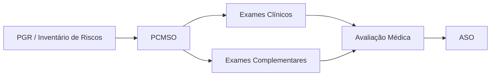
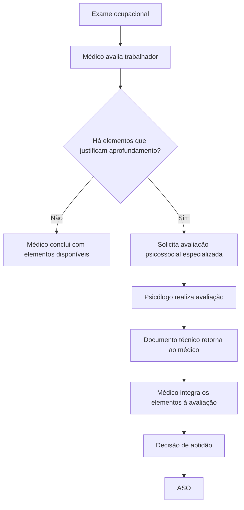
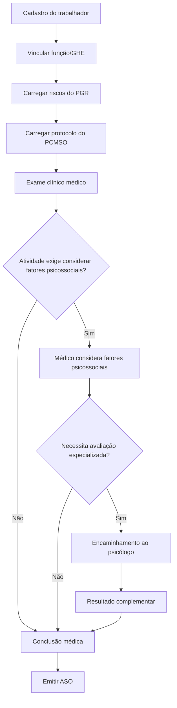

# Especificação Funcional — Avaliação Psicossocial, Aptidão Ocupacional e Integração PCMSO/PGR

> Documento de orientação para desenvolvimento no Cursor.
>
> **Base principal:** Ministério do Trabalho e Emprego — Secretaria de Inspeção do Trabalho — Nota Técnica SEI nº 4655/2024/MTE.
>
> **Interessada:** Serviço Social da Indústria - SESI.
>
> **Assunto:** Dúvida sobre Avaliação Psicossocial - Normas Regulamentadoras.
>
> **Objetivo:** transformar os fundamentos e conclusões da Nota Técnica em regras de domínio, fluxos, validações, permissões e estruturas de dados para um sistema de SST que integre PGR, PCMSO, exames ocupacionais, fatores psicossociais, avaliação psicossocial especializada, aptidão e ASO.

---

# 1. REGRA CENTRAL

O sistema deve distinguir obrigatoriamente:

```text
1. FATORES DE RISCOS PSICOSSOCIAIS RELACIONADOS AO TRABALHO
   -> objeto de identificação e gerenciamento no PGR/GRO.

2. AVALIAÇÃO DOS FATORES PSICOSSOCIAIS NO EXAME OCUPACIONAL
   -> elementos considerados pelo médico na avaliação de aptidão.

3. AVALIAÇÃO PSICOSSOCIAL ESPECIALIZADA
   -> procedimento regulamentado pelo Conselho Federal de Psicologia,
      realizado por psicólogo quando indicado.
```

Esses três conceitos não devem ser tratados como sinônimos.

---

# 2. APTIDÃO OCUPACIONAL

A decisão final sobre aptidão para função ou tarefa é médica.

```text
APTIDÃO / INAPTIDÃO
        |
        v
RESPONSABILIDADE MÉDICA
```

O sistema nunca deve permitir que RH, gestor, técnico de segurança, engenheiro, psicólogo, questionário, algoritmo ou IA definam aptidão ocupacional.

---

# 3. ASO

O ASO é documento médico.

```pseudo
if usuario.profissao != "MEDICO":
    bloquear_emissao_ASO()
```

Mesmo que exista avaliação psicossocial realizada por psicólogo, o ASO continua sendo emitido pelo médico.

---

# 4. CENTRALIDADE DO MÉDICO NO PCMSO

A arquitetura deve refletir a centralidade do profissional médico no PCMSO.

```yaml
pcmso:
  empresa_id:
  medico_responsavel:
  crm:
  uf_crm:
  especialidade:
  data_inicio_responsabilidade:
  status:
```

O sistema deve permitir registrar médico do trabalho responsável pelo PCMSO e, nas hipóteses normativas cabíveis, médico de outra especialidade quando não houver médico do trabalho na localidade.

---

# 5. OBJETIVOS DO PCMSO A SEREM SUPORTADOS

O sistema deve permitir que o PCMSO:

- rastreie e detecte precocemente agravos relacionados ao trabalho;
- detecte possíveis exposições excessivas;
- defina aptidão para funções ou tarefas;
- subsidie medidas de prevenção;
- monitore a eficácia das medidas;
- subsidie análises epidemiológicas;
- subsidie afastamentos e encaminhamentos;
- apoie reabilitação e readaptação profissional.

---

# 6. INTEGRAÇÃO PGR -> PCMSO

O PCMSO deve estar conectado ao PGR.



Os exames complementares devem estar relacionados aos riscos ocupacionais classificados no PGR e tecnicamente justificados no PCMSO.

---

# 7. INCONSISTÊNCIAS ENTRE PGR E PCMSO

O sistema deve permitir que o médico registre inconsistências observadas no inventário de riscos e acione os responsáveis pelo PGR.

```yaml
inconsistencia_pgr:
  id:
  empresa_id:
  risco_id:
  identificado_por_medico:
  descricao:
  data:
  status:
  responsavel_pgr:
  resposta:
  data_reavaliacao:
```

Fluxo:

```text
MÉDICO IDENTIFICA INCONSISTÊNCIA
        |
        v
REGISTRA
        |
        v
RESPONSÁVEIS PELO PGR SÃO NOTIFICADOS
        |
        v
REAVALIAÇÃO CONJUNTA
```

---

# 8. EXAMES OCUPACIONAIS

O sistema deve suportar:

- admissional;
- periódico;
- retorno ao trabalho;
- mudança de risco ocupacional;
- demissional;
- outros procedimentos previstos no PCMSO.

```yaml
exame_ocupacional:
  id:
  trabalhador_id:
  empresa_id:
  tipo:
  data:
  medico_examinador:
  pcmso_id:
  riscos_considerados:
  atividades_especificas:
  exames_complementares:
  fatores_psicossociais_considerados:
  conclusao_medica:
  aso_id:
```

---

# 9. APTIDÃO PARA ATIVIDADES ESPECÍFICAS

O sistema deve suportar aptidão específica quando determinada NR exigir.

```yaml
aptidao_especifica:
  id:
  exame_ocupacional_id:
  atividade:
  norma_referencia:
  requisito:
  fatores_considerados:
  resultado_medico:
  consignado_aso:
```

A Nota Técnica utiliza como exemplos NR-20, NR-33 e NR-35.

---

# 10. NR-20

Para integrantes de equipe de resposta a emergências, o sistema deve permitir registrar:

```text
exames médicos específicos
+
fatores de riscos psicossociais
+
ASO
```

Regra de configuração:

```yaml
atividade_especifica:
  codigo: NR20_EMERGENCIA
  exige_avaliacao_medica_especifica: true
  considerar_fatores_psicossociais: true
  registrar_no_aso: true
```

---

# 11. NR-33

Para trabalho em espaço confinado, o sistema deve permitir que o médico avalie aptidão física e mental considerando fatores de riscos psicossociais.

```text
atividade NR-33
   |
   v
riscos do PGR
   |
   v
avaliação médica
   |
   +--> fatores psicossociais
   +--> exames complementares se indicados
   |
   v
aptidão médica
```

O sistema não deve usar questionário automático para concluir aptidão.

---

# 12. NR-35

Para trabalho em altura, o sistema deve permitir que o médico considere:

- estado de saúde;
- patologias que possam ocasionar mal súbito;
- fatores psicossociais;
- necessidade de exames complementares.

Importante:

```text
TRABALHO EM ALTURA
!=
AVALIAÇÃO PSICOLÓGICA AUTOMATICAMENTE OBRIGATÓRIA
```

A necessidade de aprofundamento deve decorrer da avaliação médica.

---

# 13. DISTINÇÃO ENTRE "FATORES PSICOSSOCIAIS" E "AVALIAÇÃO PSICOSSOCIAL"

A expressão:

```text
"considerar fatores psicossociais"
```

não significa automaticamente:

```text
"realizar avaliação psicossocial com psicólogo"
```

Essa distinção deve ser preservada em toda a aplicação.

---

# 14. AVALIAÇÃO MÉDICA DOS FATORES PSICOSSOCIAIS

O médico pode considerar fatores psicossociais utilizando, conforme boa técnica:

- anamnese;
- exame clínico;
- informações do PGR;
- histórico ocupacional;
- instrumentos ou técnicas adequadas;
- exames complementares;
- avaliação psicossocial especializada, quando indicada.

A definição dos elementos necessários pertence ao julgamento profissional médico.

---

# 15. AVALIAÇÃO PSICOSSOCIAL ESPECIALIZADA

A avaliação psicossocial especializada deve possuir módulo próprio.

```yaml
avaliacao_psicossocial_especializada:
  id:
  trabalhador_id:
  solicitacao_medica_id:
  psicologo_id:
  crp:
  data_solicitacao:
  data_realizacao:
  finalidade:
  atividade_relacionada:
  norma_relacionada:
  documento_resultante:
  status:
```

Esse procedimento:

```text
NÃO É ASO
NÃO SUBSTITUI EXAME CLÍNICO
NÃO TRANSFERE AO PSICÓLOGO A DECISÃO FINAL DE APTIDÃO
```

---

# 16. PROFISSIONAL EXECUTOR

Quando a expressão "avaliação psicossocial" estiver sendo usada na acepção regulamentada pelo Conselho Federal de Psicologia:

```text
PROFISSIONAL EXECUTOR = PSICÓLOGO
```

O sistema deve validar categoria profissional e registro no CRP.

```yaml
profissional:
  categoria: PSICOLOGIA
  registro_conselho: CRP
  situacao_registro:
```

---

# 17. SOLICITAÇÃO MÉDICA

A avaliação psicossocial especializada deve ser vinculada a uma solicitação médica quando utilizada como elemento complementar da avaliação de aptidão.

```yaml
solicitacao_avaliacao_psicossocial:
  id:
  medico_id:
  trabalhador_id:
  exame_ocupacional_id:
  motivo:
  elementos_justificadores:
  atividade:
  norma_relacionada:
  data:
  prioridade:
  status:
```

---

# 18. FLUXO CORRETO



---

# 19. AVALIAÇÃO PSICOSSOCIAL COMO COMPLEMENTAR

Para fins de sistema:

```text
EXAME CLÍNICO
    +
EXAMES COMPLEMENTARES, QUANDO INDICADOS
    +
AVALIAÇÃO PSICOSSOCIAL, SE SOLICITADA
    =
ELEMENTOS PARA DECISÃO MÉDICA
```

---

# 20. NÃO É AUTOMATICAMENTE OBRIGATÓRIA

Não implementar:

```pseudo
if atividade == "NR35":
    exigir_psicologo()
```

Nem:

```pseudo
if atividade == "NR33":
    exigir_teste_psicologico()
```

Nem:

```pseudo
if fator_psicossocial == true:
    solicitar_avaliacao_psicossocial()
```

A Nota Técnica admite avaliação psicológica como recomendável em determinadas situações, mas não como obrigação automática em todos os casos.

---

# 21. RESPONSABILIDADE QUANDO NÃO HÁ ENCAMINHAMENTO

Se o médico não solicitar avaliação psicossocial especializada, a responsabilidade pela avaliação dos fatores psicossociais no contexto da aptidão permanece com ele.

O sistema deve permitir registrar justificativa técnica:

```yaml
decisao_nao_encaminhar:
  medico_id:
  exame_id:
  data:
  justificativa_tecnica:
  elementos_avaliados:
```

---

# 22. IA NÃO DECIDE ENCAMINHAMENTO

A IA pode:

- organizar dados;
- apontar inconsistências;
- indicar que existem elementos para análise médica;
- sugerir perguntas complementares;
- preparar minuta de registro.

A IA não pode afirmar autonomamente:

```text
"Este trabalhador precisa obrigatoriamente de avaliação psicológica."
```

Preferir:

```text
"Há elementos registrados que podem justificar avaliação complementar. A necessidade deve ser definida pelo médico responsável."
```

---

# 23. MATRIZ DE RESPONSABILIDADES

| Atividade | Médico | Psicólogo | SST/PGR | RH | Sistema/IA |
|---|---:|---:|---:|---:|---:|
| Identificar riscos no PGR | Participa | Pode participar | Sim | Apoio | Apoio |
| Avaliar fatores psicossociais organizacionais | Pode subsidiar | Pode participar | Sim | Apoio | Apoio |
| Exame clínico ocupacional | **Sim** | Não | Não | Não | Não |
| Definir aptidão | **Sim** | Não | Não | Não | Não |
| Emitir ASO | **Sim** | Não | Não | Não | Não |
| Solicitar avaliação psicossocial complementar | **Sim** | - | Não | Não | Não |
| Realizar avaliação psicossocial regulamentada pelo CFP | Não | **Sim** | Não | Não | Não |
| Emitir documento psicológico | Não | **Sim** | Não | Não | Não |
| Integrar resultado à decisão de aptidão | **Sim** | Subsidia | Não | Não | Não |

---

# 24. SEPARAÇÃO DE MÓDULOS

Arquitetura recomendada:

```text
MÓDULO 1 — GRO/PGR
  -> riscos coletivos e ocupacionais

MÓDULO 2 — PCMSO
  -> planejamento médico ocupacional

MÓDULO 3 — EXAMES OCUPACIONAIS
  -> atendimento individual

MÓDULO 4 — AVALIAÇÃO PSICOSSOCIAL ESPECIALIZADA
  -> psicólogo

MÓDULO 5 — ASO
  -> decisão médica

MÓDULO 6 — INDICADORES AGREGADOS
  -> retroalimentação preventiva
```

---

# 25. PGR NÃO É PRONTUÁRIO MÉDICO

O PGR trata de riscos ocupacionais.

O prontuário médico é individual.

```text
PGR
  |
  +--> dados ocupacionais coletivos
  |
  v
PCMSO
  |
  v
PRONTUÁRIO MÉDICO
```

Não gravar dados clínicos individualizados diretamente no inventário de riscos.

---

# 26. PRONTUÁRIO MÉDICO

```yaml
prontuario_medico:
  id:
  trabalhador_id:
  medico_responsavel:
  acesso_restrito: true
  registros:
  exames:
  documentos:
```

Os dados clínicos e complementares devem permanecer sob acesso restrito e responsabilidade médica.

---

# 27. CONTROLE DE ACESSO

| Perfil | PGR | PCMSO | Prontuário | Avaliação Psicossocial | ASO |
|---|---|---|---|---|---|
| Administrador técnico | Configuração | Configuração | Não | Configuração | Não |
| Médico PCMSO | Leitura | Total | Total | Solicitar/consultar | Emitir |
| Médico examinador | Leitura necessária | Leitura necessária | Atendimento | Solicitar/consultar | Emitir |
| Psicólogo | Contexto necessário | Não integral | Não integral | Executar | Não |
| SST | Total PGR | Dados ocupacionais | Não | Dados não clínicos | Restrito |
| RH | Estrutura | Administrativo | Não | Não clínico | Status documental |
| Trabalhador | Seus dados permitidos | - | Conforme regra | Seus documentos permitidos | Seu ASO |
| IA | Mínimo necessário | Mínimo | Restringido | Restringido | Nunca emitir |

---

# 28. PRINCÍPIO DO MENOR PRIVILÉGIO

```pseudo
if user.role == "RH":
    deny(prontuario_medico.detalhes_clinicos)
```

Ter acesso à empresa não significa ter acesso ao conteúdo clínico.

---

# 29. FLUXO ADMISSIONAL



---

# 30. FLUXO PERIÓDICO

O exame periódico deve considerar:

- riscos atuais do PGR;
- função atual;
- atividades específicas;
- histórico ocupacional pertinente;
- exames previstos no PCMSO;
- mudanças de risco;
- resultados complementares anteriores quando clinicamente pertinentes.

Não repetir automaticamente avaliação psicossocial apenas porque houve uma anteriormente.

---

# 31. ALTERAÇÃO DO PGR

Quando riscos do PGR mudarem:

```text
PGR atualizado
   |
   v
verificar impacto no PCMSO
   |
   v
notificar médico responsável
   |
   v
revisar protocolos, se necessário
```

---

# 32. MOTOR DE REGRAS POR ATIVIDADE

```yaml
normative_activity_rules:
  id:
  nr:
  activity_code:
  description:
  medical_assessment_required:
  psychosocial_factors_must_be_considered:
  fitness_recorded_on_aso:
  automatic_psychological_assessment_required: false
  effective_from:
  effective_to:
  source:
```

O campo `automatic_psychological_assessment_required` deve permanecer `false` para as hipóteses tratadas nesta Nota Técnica, salvo alteração normativa futura expressa.

---

# 33. CHECKLIST MÉDICO CONFIGURÁVEL

```yaml
medical_psychosocial_checklist:
  activity_requirements:
  psychosocial_factors_from_pgr:
  reported_difficulties:
  previous_incidents:
  work_context:
  need_for_complementary_assessment:
  justification:
```

O checklist é apoio e não substitui julgamento profissional.

---

# 34. NÃO USAR SCORE COMO APTIDÃO

Proibido:

```text
SCORE >= 8 = INAPTO
```

ou:

```text
3 respostas "sim" = encaminhamento obrigatório
```

sem protocolo técnico validado e sem decisão profissional competente.

---

# 35. RESULTADO DO PSICÓLOGO

```text
PSICÓLOGO
   |
   v
DOCUMENTO TÉCNICO
   |
   v
MÉDICO
   |
   v
DECISÃO DE APTIDÃO
```

O resultado psicológico atua como subsídio.

---

# 36. INTERFACE DO PSICÓLOGO

Não criar:

```text
"Marcar trabalhador como APTO"
```

Criar:

```text
"Finalizar avaliação psicossocial"
"Emitir documento psicológico"
"Encaminhar resultado ao médico solicitante"
```

---

# 37. CONCLUSÃO MÉDICA

```yaml
medical_fitness_decision:
  id:
  exam_id:
  physician_id:
  date:
  fitness_result:
  specific_activities:
  supporting_elements:
  complementary_assessments_considered:
  technical_notes:
  aso_id:
```

`fitness_result` somente pode ser gravado por perfil médico autorizado.

---

# 38. RASTREABILIDADE

O sistema deve registrar:

```text
quem decidiu
quando decidiu
qual exame
qual atividade específica
quais riscos foram considerados
se houve avaliação complementar
quem solicitou
quem realizou
quando retornou
qual ASO foi emitido
```

---

# 39. AUDITORIA CLÍNICA

```yaml
clinical_audit_log:
  user_id:
  professional_role:
  timestamp:
  action:
  entity:
  entity_id:
  access_reason:
```

Acessos a prontuário e documentos psicológicos devem ser auditáveis.

---

# 40. DADOS SENSÍVEIS

O sistema deve aplicar:

- acesso restrito;
- segregação lógica;
- criptografia;
- logs;
- políticas de retenção;
- minimização;
- controle de exportação;
- prevenção de compartilhamento indevido.

---

# 41. DOCUMENTOS PSICOLÓGICOS

A IA não deve gerar e emitir automaticamente documento técnico privativo do psicólogo sem revisão profissional.

```yaml
psychological_document:
  id:
  psychologist_id:
  assessment_id:
  document_type:
  created_at:
  signed_at:
  version:
  file_hash:
```

---

# 42. ASSINATURAS PROFISSIONAIS

Distinguir:

```text
ASSINATURA MÉDICA
  -> ASO
  -> documentos médicos

ASSINATURA DO PSICÓLOGO
  -> documentos psicológicos

ASSINATURA SST
  -> documentos do PGR conforme responsabilidade aplicável
```

---

# 43. IA NÃO ASSINA

A IA não pode se apresentar como:

- médico;
- psicólogo;
- examinador;
- responsável técnico.

Toda minuta assistida por IA deve exigir revisão humana.

```yaml
ai_assistance:
  generated_by_ai: true
  reviewed_by:
  reviewed_at:
  approved_by:
```

---

# 44. RISCO DO PGR NÃO GERA AVALIAÇÃO INDIVIDUAL AUTOMÁTICA

```text
RISCO PSICOSSOCIAL NO PGR
!=
AVALIAÇÃO PSICOSSOCIAL INDIVIDUAL AUTOMÁTICA
```

O primeiro é gerenciamento coletivo.

O segundo é procedimento individual complementar, quando indicado.

---

# 45. EXEMPLO CORRETO

```text
PGR:
GHE Operação
Fator: excesso de demandas
Classificação: alta

PCMSO:
Médico considera o risco no planejamento ocupacional.

Exame:
Médico avalia trabalhador.

Se houver elementos justificadores:
Médico solicita avaliação psicossocial especializada.

Psicólogo:
Realiza procedimento de sua competência.

Médico:
Analisa o resultado e decide aptidão.

ASO:
Emitido pelo médico.
```

---

# 46. EXEMPLO INCORRETO

```text
PGR detecta risco alto
        |
        v
sistema agenda psicólogo automaticamente
        |
        v
psicólogo marca INAPTO
        |
        v
sistema gera ASO
```

Esse fluxo deve ser bloqueado.

---

# 47. REGRAS DE CONSISTÊNCIA

### R01
ASO somente pode ser emitido por médico.

### R02
Aptidão somente pode ser concluída por médico.

### R03
Avaliação psicossocial regulamentada pelo CFP deve ser atribuída a psicólogo.

### R04
Resultado psicológico é subsídio à decisão médica quando utilizado para aptidão.

### R05
PGR deve subsidiar PCMSO.

### R06
Exames complementares devem possuir relação com riscos ocupacionais e justificativa técnica.

### R07
NR-35 não gera automaticamente avaliação psicológica obrigatória.

### R08
NR-33 não gera automaticamente teste psicológico obrigatório.

### R09
NR-20 não gera automaticamente avaliação psicossocial especializada.

### R10
Considerar fatores psicossociais é diferente de realizar avaliação psicossocial.

### R11
Sem encaminhamento ao psicólogo, a responsabilidade pela avaliação de aptidão permanece médica.

### R12
Dados clínicos não devem ser inseridos no PGR.

### R13
Dados psicológicos individuais não devem aparecer em dashboard gerencial comum.

### R14
IA nunca determina aptidão.

---

# 48. VALIDAÇÕES DE BACKEND

```pseudo
function emitASO(user, exam):
    if user.professional_type != PHYSICIAN:
        raise Forbidden("ASO requires physician")

function setFitness(user, exam, result):
    if user.professional_type != PHYSICIAN:
        raise Forbidden("Fitness decision requires physician")

function executePsychosocialAssessment(user, assessment):
    if user.professional_type != PSYCHOLOGIST:
        raise Forbidden("Psychosocial assessment requires psychologist")

function requirePsychosocialAssessmentAutomatically(activity):
    return false
```

---

# 49. MODELO DE DADOS

```text
companies
workers
establishments
sectors
jobs
ghes

pgr_programs
pgr_risks
risk_inventory
psychosocial_risk_factors

pcmso_programs
pcmso_protocols
occupational_exams
complementary_exams
specific_activity_requirements

physicians
psychologists
professional_registrations

medical_records
medical_fitness_decisions
aso_documents

psychosocial_assessment_requests
psychosocial_assessments
psychological_documents

pgr_pcmso_inconsistencies
professional_signatures
audit_logs
clinical_access_logs
document_versions
```

---

# 50. STATUS DA SOLICITAÇÃO PSICOSSOCIAL

```text
DRAFT
REQUESTED
ACCEPTED
SCHEDULED
IN_PROGRESS
COMPLETED
SENT_TO_PHYSICIAN
REVIEWED_BY_PHYSICIAN
CLOSED
CANCELED
```

---

# 51. ACESSO DO RH

RH pode precisar visualizar:

- exame pendente;
- exame concluído;
- ASO disponível;
- vencimento;
- status de aptidão quando necessário ao processo laboral.

Não deve receber por padrão:

- conteúdo de entrevistas psicológicas;
- anamnese;
- hipóteses clínicas;
- resultados integrais de testes;
- prontuário.

---

# 52. DASHBOARD MÉDICO

Pode conter:

- trabalhadores pendentes;
- riscos do PGR;
- protocolos do PCMSO;
- atividades específicas;
- avaliações complementares;
- solicitações psicossociais;
- retornos do psicólogo;
- inconsistências PGR/PCMSO;
- ASOs.

---

# 53. DASHBOARD DO PSICÓLOGO

Pode conter:

- solicitações recebidas;
- finalidade;
- médico solicitante;
- atividade;
- prazo;
- avaliações em andamento;
- documentos emitidos.

Não pode permitir:

- emitir ASO;
- editar decisão médica;
- alterar aptidão.

---

# 54. ALERTAS DE INTERFACE

```text
ATENÇÃO: esta atividade exige avaliação médica de aptidão específica.

ATENÇÃO: fatores psicossociais devem ser considerados na avaliação médica quando aplicável.

ATENÇÃO: avaliação psicossocial especializada não é automaticamente obrigatória. A necessidade deve ser definida pelo médico.

ATENÇÃO: somente psicólogo realiza a avaliação psicossocial regulamentada pelo CFP.

ATENÇÃO: somente médico conclui aptidão e emite ASO.
```

---

# 55. INTEGRAÇÃO COM O MARKDOWN NR-01

Quando utilizado junto com o arquivo anterior:

```text
ESPECIFICACAO_SISTEMA_NR01_RISCOS_PSICOSSOCIAIS_CURSOR.md
```

a lógica integrada deve ser:

```text
NR-01 / PGR
    |
    | gerenciamento coletivo
    v
PCMSO
    |
    | acompanhamento de saúde
    v
EXAME MÉDICO
    |
    +--> avaliação psicossocial especializada se indicada
    |
    v
APTIDÃO
    |
    v
ASO
```

---

# 56. NÃO CONFUNDIR RESULTADO COLETIVO COM INDIVIDUAL

```text
"GHE apresenta exposição elevada a excesso de demanda"
```

não permite concluir:

```text
"Todos os trabalhadores do GHE são inaptos."
```

---

# 57. RISCO COLETIVO E PCMSO

Se o PGR identificar risco psicossocial relevante, o sistema pode:

- comunicar o PCMSO de forma agregada;
- solicitar revisão de protocolo;
- sugerir medidas de prevenção;
- acompanhar indicadores.

Não deve:

- gerar diagnóstico;
- marcar indivíduos como suspeitos;
- convocar seletivamente trabalhadores usando respostas anônimas.

---

# 58. PROIBIÇÃO DE REIDENTIFICAÇÃO

O módulo coletivo psicossocial e o módulo clínico devem ser segregados.

Nunca usar resposta anônima de campanha para identificar trabalhador a ser encaminhado.

---

# 59. ENCAMINHAMENTO COM JUSTIFICATIVA

```yaml
request:
  reason: >
    Durante avaliação ocupacional, o médico identificou elementos que justificam
    aprofundamento da avaliação da capacidade para atividade específica.
```

Evitar justificativas genéricas como:

```text
"Encaminhado porque a empresa possui risco psicossocial."
```

---

# 60. TERMINOLOGIA DE INTERFACE

Usar:

- Consideração de fatores psicossociais;
- Avaliação médica de aptidão;
- Avaliação psicossocial especializada;
- Solicitação médica;
- Exame complementar;
- Documento psicológico;
- ASO.

Evitar rótulos automáticos como:

- "Teste psicológico obrigatório NR-35";
- "Exame psicossocial NR-33 automático";
- "Psicotécnico NR-35".

---

# 61. TEXTOS DE AJUDA

## Fatores psicossociais

```text
Fatores psicossociais podem ser considerados pelo médico na avaliação da aptidão quando relacionados às exigências da atividade e às Normas Regulamentadoras aplicáveis.
```

## Avaliação psicossocial especializada

```text
Procedimento realizado por profissional da Psicologia quando solicitado como avaliação complementar no contexto da aptidão ocupacional.
```

## Decisão de aptidão

```text
A conclusão de aptidão ocupacional e a emissão do ASO são atribuições médicas.
```

---

# 62. RELATÓRIO DE RASTREABILIDADE

```markdown
# Histórico de Avaliação de Aptidão

## Trabalhador
## Função
## Atividade específica
## Riscos ocupacionais considerados
## Médico examinador
## Exames complementares
## Consideração de fatores psicossociais
## Avaliação psicossocial especializada
### Solicitada? Sim/Não
### Médico solicitante
### Psicólogo executor
### Data
### Documento emitido
## Decisão médica
## ASO
## Histórico de versões
```

---

# 63. RELATÓRIO GERENCIAL X CLÍNICO

Relatório gerencial:

```text
Avaliação complementar concluída.
ASO emitido.
```

Relatório clínico restrito:

```text
anamnese
fundamentos clínicos
exames
documentos complementares
```

---

# 64. VERSIONAMENTO NORMATIVO

```yaml
normative_reference:
  id:
  type:
  number:
  title:
  url:
  publication_date:
  effective_date:
  version:
  status:
  last_checked_at:
```

Referências principais:

- NR-07;
- NR-20;
- NR-33;
- NR-35;
- Resolução CFP nº 2/2022;
- Nota Técnica SEI nº 4655/2024/MTE.

---

# 65. SNAPSHOT NORMATIVO POR EXAME

```yaml
regulatory_snapshot:
  nr7_version:
  nr20_version:
  nr33_version:
  nr35_version:
  cfp_resolution_version:
  rule_engine_version:
```

Mudanças futuras de regra não devem alterar retroativamente exames já concluídos.

---

# 66. TESTES DE ACEITE

## Teste 1 — Psicólogo tenta emitir ASO

```text
DADO: usuário psicólogo.
QUANDO: clicar em emitir ASO.
ENTÃO: bloquear.
```

## Teste 2 — RH tenta definir aptidão

```text
ENTÃO: bloquear.
```

## Teste 3 — NR-35

```text
DADO: trabalhador em altura.
ENTÃO: alertar para consideração médica dos fatores psicossociais.
MAS: não agendar psicólogo automaticamente.
```

## Teste 4 — Encaminhamento médico

```text
DADO: médico identifica necessidade de aprofundamento.
ENTÃO: permitir solicitação de avaliação psicossocial especializada.
```

## Teste 5 — Retorno do psicólogo

```text
DADO: psicólogo conclui avaliação.
ENTÃO: resultado retorna ao médico.
NÃO: gerar ASO automaticamente.
```

## Teste 6 — PGR de alto risco

```text
DADO: GHE com risco psicossocial elevado.
ENTÃO: comunicar PCMSO de forma agregada.
NÃO: marcar todos como inaptos.
```

---

# 67. GUARDRAILS DA IA

```text
Você é um módulo assistivo de SST.

NUNCA:
- conclua aptidão ou inaptidão;
- emita ASO;
- realize diagnóstico psicológico;
- realize diagnóstico médico;
- declare avaliação psicossocial obrigatória sem fundamento;
- atribua competência de psicólogo ao médico;
- atribua competência médica ao psicólogo;
- transforme risco coletivo do PGR em diagnóstico individual.

SE houver dúvida:
"REQUER DECISÃO DO PROFISSIONAL COMPETENTE".
```

---

# 68. REGRAS CRÍTICAS PARA O CURSOR

```text
[CRÍTICO]
ASO = emissão médica.

[CRÍTICO]
APTIDÃO = decisão médica.

[CRÍTICO]
AVALIAÇÃO PSICOSSOCIAL regulamentada pelo CFP = psicólogo.

[CRÍTICO]
RESULTADO DO PSICÓLOGO = subsídio, não substituição da decisão médica.

[CRÍTICO]
FATORES PSICOSSOCIAIS != avaliação psicossocial especializada.

[CRÍTICO]
NR-20/33/35 não devem virar gatilho automático universal para psicólogo.

[CRÍTICO]
DADOS DO PGR são coletivos e não devem virar prontuário.

[CRÍTICO]
DADOS CLÍNICOS não devem ficar expostos a perfis gerenciais.

[CRÍTICO]
IA jamais define aptidão.
```

---

# 69. FLUXO DE DECISÃO EM PSEUDOCÓDIGO

```pseudo
function occupationalAssessment(worker, activity):

    risks = loadPGRRisks(worker.GHE)

    protocol = loadPCMSOProtocol(worker.job, activity, risks)

    exam = physician.performClinicalExam(worker, protocol)

    if activity.requiresPsychosocialFactorsConsideration:
        physician.considerPsychosocialFactors(exam, risks)

    if physician.decidesComplementaryPsychosocialAssessmentNeeded():
        request = physician.requestPsychosocialAssessment()
        result = psychologist.performAssessment(request)
        physician.review(result)

    fitness = physician.defineFitness()

    aso = physician.issueASO(fitness)

    return aso
```

---

# 70. ANTIPADRÃO

Nunca implementar:

```pseudo
score = questionnaire(worker)

if score > 70:
    worker.status = "INAPTO"

if worker.worksAtHeight:
    autoSchedulePsychologist()

psychologist.issueASO()
```

---

# 71. ARQUITETURA RECOMENDADA

```text
┌─────────────────────────┐
│ GRO / PGR               │
│ riscos ocupacionais     │
└───────────┬─────────────┘
            │
            v
┌─────────────────────────┐
│ PCMSO                   │
│ protocolos médicos      │
└───────────┬─────────────┘
            │
            v
┌─────────────────────────┐
│ Exame Ocupacional       │
│ Médico                  │
└───────────┬─────────────┘
            │
            ├── sem aprofundamento
            │       |
            │       v
            │   decisão médica
            │
            └── com aprofundamento
                    |
                    v
             ┌──────────────┐
             │ Psicólogo    │
             │ Avaliação    │
             └──────┬───────┘
                    │
                    v
             retorna ao médico
                    │
                    v
             decisão de aptidão
                    │
                    v
                   ASO
```

---

# 72. ORDEM DE IMPLEMENTAÇÃO

## Fase 1 — Cadastros profissionais

- médicos;
- CRM;
- psicólogos;
- CRP;
- empresas;
- trabalhadores;
- funções;
- atividades.

## Fase 2 — PGR/PCMSO

- importar riscos;
- vincular função/GHE;
- protocolos médicos;
- requisitos por NR.

## Fase 3 — Exames

- agenda;
- atendimento;
- prontuário;
- exames complementares;
- decisão médica;
- ASO.

## Fase 4 — Psicossocial

- solicitação médica;
- fila do psicólogo;
- execução;
- documento;
- retorno ao médico.

## Fase 5 — Segurança

- RBAC;
- logs;
- segregação clínica;
- auditoria.

## Fase 6 — IA

- extração de riscos;
- alertas;
- assistente de consistência;
- apoio documental;
- nunca decisão autônoma.

---

# 73. CHECKLIST FINAL DE FEATURE

```text
[ ] Pode concluir aptidão sem médico?
    Se sim -> REPROVAR.

[ ] Permite psicólogo emitir ASO?
    Se sim -> REPROVAR.

[ ] Obriga psicólogo automaticamente pela atividade?
    Se sim -> REVISAR FUNDAMENTO.

[ ] Diferencia fatores psicossociais de avaliação psicossocial?
    Se não -> REPROVAR.

[ ] Resultado psicológico retorna ao médico?
    Se não -> REVISAR FLUXO.

[ ] Dados clínicos estão separados do PGR?
    Se não -> REPROVAR.

[ ] IA pode classificar trabalhador como apto/inapto?
    Se sim -> REPROVAR.

[ ] Existe trilha de auditoria?
    Se não -> REPROVAR.
```

---

# 74. REFERÊNCIA PRINCIPAL

**Ministério do Trabalho e Emprego — Secretaria de Inspeção do Trabalho — Departamento de Segurança e Saúde no Trabalho — Coordenação-Geral de Normatização e Registros.**

**Nota Técnica SEI nº 4655/2024/MTE**

Assunto:

```text
Dúvida sobre Avaliação Psicossocial - Normas Regulamentadoras
```

Data:

```text
23 de agosto de 2024
```

Processo:

```text
13090.201080/2024-84
```

SEI:

```text
3150702
```

---

# 75. SÍNTESE DA REGRA DE DOMÍNIO

```text
O médico é responsável pela avaliação da aptidão do trabalhador.

Quando as Normas Regulamentadoras exigirem, deve considerar fatores psicossociais.

O médico define os elementos necessários para formar sua conclusão.

Pode solicitar exames complementares.

Pode solicitar avaliação psicossocial especializada quando houver elementos que a justifiquem.

A avaliação psicossocial, em sua acepção regulamentada pelo CFP, é realizada por profissional da Psicologia.

O psicólogo não substitui o médico na decisão de aptidão.

O médico continua responsável pela conclusão de aptidão e emissão do ASO.
```

---

# 76. REGRA DE PREVALÊNCIA

Em caso de conflito:

```text
este Markdown
        versus
Norma Regulamentadora vigente / legislação / ato profissional vigente
```

prevalece a fonte oficial vigente.

O sistema deve manter regras normativas versionadas e revisáveis.

---

# 77. INSTRUÇÃO FINAL AO CURSOR

```text
1. Identifique se o fluxo trata de RISCO PSICOSSOCIAL DO PGR ou AVALIAÇÃO PSICOSSOCIAL INDIVIDUAL.

2. Se for risco do PGR, seguir gerenciamento coletivo.

3. Se for aptidão, a decisão pertence ao médico.

4. Se houver necessidade de avaliação psicossocial especializada, deve existir solicitação médica e execução por psicólogo.

5. Nunca transformar automaticamente:
   risco coletivo -> diagnóstico individual;
   score -> aptidão;
   atividade NR-20/33/35 -> psicólogo obrigatório;
   documento psicológico -> ASO.

6. Preserve segregação de dados.

7. Registre responsabilidade profissional.

8. Registre versão normativa.

9. Mantenha trilha de auditoria.

10. Se a regra profissional ou normativa não estiver clara, bloquear automação decisória e exigir validação humana.
```
