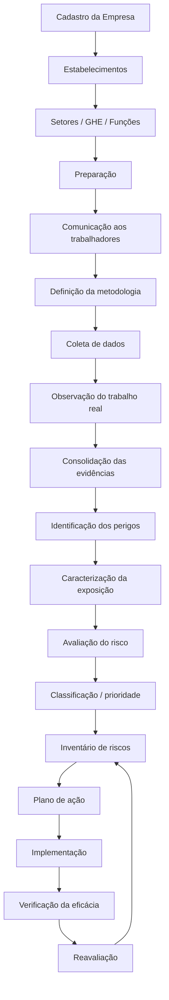

# Especificação Funcional — Sistema de Gestão de Fatores de Riscos Psicossociais Relacionados ao Trabalho

> Documento de orientação para desenvolvimento no Cursor.
>
> **Base principal:** Ministério do Trabalho e Emprego — *Guia de informações sobre os Fatores de Riscos Psicossociais Relacionados ao Trabalho — NR-1 / Gerenciamento de Riscos Ocupacionais (GRO)*.
>
> **Objetivo:** traduzir as orientações do Guia NR-1 em regras funcionais, regras de negócio, estruturas de dados, validações e fluxos para um sistema de SST voltado à identificação, avaliação, controle, acompanhamento e documentação dos fatores de riscos psicossociais relacionados ao trabalho.
>
> **Importante:** este documento é uma especificação de sistema baseada no guia informativo do MTE. O software não deve “inventar conformidade”. Sempre devem prevalecer a NR-1, a NR-17 e demais normas vigentes, além da análise técnica do profissional responsável.

---

## 1. PRINCÍPIO CENTRAL DO SISTEMA

O sistema deve tratar os fatores de riscos psicossociais **como riscos ocupacionais relacionados ao trabalho**, integrados ao:

- GRO — Gerenciamento de Riscos Ocupacionais;
- PGR — Programa de Gerenciamento de Riscos;
- Inventário de Riscos Ocupacionais;
- Plano de Ação;
- NR-17 — Ergonomia;
- AEP — Avaliação Ergonômica Preliminar;
- AET — Análise Ergonômica do Trabalho, quando aplicável.

### Regra obrigatória

O sistema **não pode transformar a avaliação psicossocial ocupacional em diagnóstico de saúde mental do trabalhador**.

A avaliação deve se concentrar nas **condições de trabalho**, na organização e gestão do trabalho e na exposição dos grupos de trabalhadores aos fatores de risco.

Portanto:

```text
ERRADO:
"Funcionário João apresenta alto risco de depressão."

CORRETO:
"O grupo de trabalhadores do setor X apresenta exposição a fatores relacionados
a excesso de demandas, baixa autonomia e insuficiência de suporte organizacional."
```

---

# 2. ESCOPO DOS FATORES PSICOSSOCIAIS

Para fins do GRO, o sistema deve considerar fatores psicossociais **relacionados ao trabalho**.

Não devem ser incluídos automaticamente:

- problemas familiares;
- condições financeiras pessoais;
- vida conjugal;
- religião;
- orientação política;
- histórico pessoal sem relação com o trabalho;
- diagnóstico psiquiátrico;
- informações clínicas individuais;
- fatos da vida privada que não sejam decorrentes da atividade de trabalho.

O sistema deve trabalhar prioritariamente com fatores decorrentes de:

- concepção do trabalho;
- organização do trabalho;
- gestão do trabalho;
- relações socioprofissionais;
- exigências das atividades;
- autonomia;
- suporte;
- reconhecimento;
- comunicação;
- violência ou assédio relacionados ao trabalho.

---

# 3. CATÁLOGO INICIAL DE FATORES DE RISCO

O sistema deve possuir um catálogo parametrizável.

A lista abaixo deve ser tratada como **exemplificativa, nunca exaustiva**.

| Código | Fator de risco psicossocial | Possíveis consequências ocupacionais |
|---|---|---|
| PSICO-001 | Assédio de qualquer natureza no trabalho | Transtornos mentais e outros agravos |
| PSICO-002 | Má gestão de mudanças organizacionais | Transtornos mentais, DORT e outros agravos |
| PSICO-003 | Baixa clareza de papel ou função | Transtornos mentais e outros agravos |
| PSICO-004 | Baixas recompensas e reconhecimento | Transtornos mentais e outros agravos |
| PSICO-005 | Falta de suporte ou apoio no trabalho | Transtornos mentais e outros agravos |
| PSICO-006 | Baixo controle no trabalho / falta de autonomia | Transtornos mentais, DORT e outros agravos |
| PSICO-007 | Baixa justiça organizacional | Transtornos mentais e outros agravos |
| PSICO-008 | Eventos violentos ou traumáticos | Transtornos mentais e outros agravos |
| PSICO-009 | Baixa demanda no trabalho / subcarga | Transtornos mentais e outros agravos |
| PSICO-010 | Excesso de demandas / sobrecarga | Transtornos mentais, DORT e outros agravos |
| PSICO-011 | Más relações no local de trabalho | Transtornos mentais e outros agravos |
| PSICO-012 | Trabalho em condições de difícil comunicação | Transtornos mentais e outros agravos |
| PSICO-013 | Trabalho remoto e isolado | Transtornos mentais, fadiga e outros agravos |

### Regras do catálogo

1. Deve ser possível cadastrar novos fatores.
2. Cada fator deve possuir:
   - nome;
   - descrição;
   - categoria;
   - possíveis fontes/circunstâncias;
   - possíveis consequências;
   - exemplos;
   - referências;
   - status ativo/inativo.
3. O sistema nunca deve afirmar que um fator existe apenas porque está no catálogo.
4. O fator somente entra no inventário quando houver evidência ou conclusão técnica decorrente do processo de identificação.

---

# 4. ESTRUTURA ORGANIZACIONAL OBRIGATÓRIA

Antes de uma campanha ou avaliação, o sistema deve permitir cadastrar:

## Empresa

```yaml
empresa:
  id:
  razao_social:
  nome_fantasia:
  cnpj:
  cnae:
  grau_risco:
  endereco:
  responsavel_legal:
  responsavel_sst:
```

## Estabelecimentos

```yaml
estabelecimento:
  id:
  empresa_id:
  nome:
  endereco:
  numero_trabalhadores:
  atividade_principal:
```

## Setores

```yaml
setor:
  id:
  estabelecimento_id:
  nome:
  descricao:
  processo_produtivo:
```

## GHE / grupo de trabalhadores

O sistema deve suportar o conceito utilizado pela organização:

- GHE;
- GES;
- grupo homogêneo;
- setor;
- função;
- atividade;
- posto de trabalho.

```yaml
ghe:
  id:
  setor_id:
  codigo:
  nome:
  descricao:
  funcoes:
  numero_trabalhadores:
  atividades_reais:
```

### Regra

A avaliação de riscos deve conseguir chegar ao **grupo de trabalhadores expostos**, não apenas a um resultado geral da empresa.

---

# 5. PREPARAÇÃO DA AVALIAÇÃO

Antes de liberar a coleta, o sistema deve exigir um checklist de preparação.

## Dados recomendados

- estabelecimentos;
- setores;
- processos;
- atividades;
- postos;
- funções;
- número de trabalhadores;
- jornada;
- turnos;
- forma de organização do trabalho;
- trabalho presencial/remoto/híbrido;
- dados históricos disponíveis;
- acidentes;
- afastamentos;
- CAT;
- indicadores agregados do PCMSO;
- avaliações anteriores;
- AEP;
- AET, quando existente;
- medidas de prevenção existentes.

### Regra importante

Dados de saúde devem ser utilizados prioritariamente **de forma agregada e compatível com a finalidade de SST**, sem exposição desnecessária de dados individuais.

---

# 6. DEFINIÇÃO DA METODOLOGIA

O MTE não determina uma única ferramenta ou questionário.

O sistema não deve afirmar:

```text
"Este é o questionário oficial da NR-1."
```

A aplicação deve possuir um cadastro de metodologias.

```yaml
metodologia:
  id:
  nome:
  versao:
  autor:
  referencia:
  fundamentacao_cientifica:
  tipo:
    - questionario
    - observacao
    - entrevista
    - oficina
    - workshop
    - metodo_combinado
  requisitos_de_aplicacao:
  criterios_de_calculo:
  publico_alvo:
  status:
```

### Validações

Antes de habilitar uma metodologia, registrar:

- fundamentação técnica/científica;
- adequação ao risco avaliado;
- público para o qual foi validada;
- versão;
- critérios de interpretação;
- qualificações necessárias para aplicação.

---

# 7. ANONIMATO E CONFIDENCIALIDADE

Quando a avaliação utilizar questionários coletivos, o sistema deve ser projetado para preservar o anonimato.

## Regra de arquitetura recomendada

Separar:

```text
TOKEN DE PARTICIPAÇÃO
        |
        v
controle de envio/resposta
        |
        +------ NÃO DEVE IDENTIFICAR AS RESPOSTAS INDIVIDUAIS
        |
        v
base anonimizada de respostas
```

### Não armazenar na mesma estrutura analítica

- CPF + respostas;
- nome + respostas;
- e-mail + respostas;
- telefone + respostas;
- matrícula + respostas.

### Permitir

Uma tabela independente poderá registrar apenas que um convite foi:

- enviado;
- entregue;
- iniciado;
- concluído.

Essa tabela não deve permitir reconstruir as respostas individuais.

---

# 8. REGRA DE TAMANHO MÍNIMO DO GRUPO

Para reduzir risco de reidentificação, o sistema deve possuir um parâmetro:

```yaml
privacidade:
  tamanho_minimo_grupo_relatorio: configuravel
```

Se o grupo não atingir o mínimo:

```text
NÃO exibir estatística individualizável.
AGREGAR o resultado a um nível organizacional superior,
quando tecnicamente adequado.
```

Exemplo:

```text
GHE com 2 trabalhadores
→ não emitir relatório detalhado isolado se isso permitir inferir respostas.
→ consolidar com outro grupo compatível ou tratar por método técnico alternativo.
```

O limite não deve ser apresentado como número determinado pela NR-1, porque o Guia não define um número fixo.

---

# 9. PARTICIPAÇÃO DOS TRABALHADORES

O sistema deve registrar mecanismos de participação:

```yaml
participacao:
  comunicacao_previa:
  consulta_trabalhadores:
  entrevista:
  observacao_trabalho_real:
  participacao_cipa:
  participacao_sesmt:
  participacao_gestores:
  registro_data:
  responsavel:
```

A participação não deve se limitar ao preenchimento do questionário.

O fluxo deve suportar:

1. preparação;
2. comunicação;
3. coleta;
4. análise;
5. discussão das medidas;
6. acompanhamento da eficácia.

---

# 10. TRABALHO REAL X TRABALHO PRESCRITO

A interface deve diferenciar explicitamente:

```yaml
atividade:
  descricao_prescrita:
  descricao_trabalho_real:
```

A avaliação deve considerar a atividade **efetivamente realizada**.

Exemplo:

```text
Prescrito:
"Atendimento administrativo."

Real:
"Atendimento simultâneo por telefone e WhatsApp, preenchimento de sistema,
cobrança de metas diárias, interrupções frequentes e ausência de pausas em
períodos de pico."
```

O campo `descricao_trabalho_real` deve ser valorizado nas análises.

---

# 11. IDENTIFICAÇÃO DO PERIGO

Para cada fator identificado, exigir:

```yaml
perigo:
  id:
  ghe_id:
  fator_risco_id:
  descricao_perigo:
  fonte_ou_circunstancia:
  atividade_relacionada:
  evidencias:
  possiveis_lesoes_agravos:
  grupo_exposto:
  medidas_existentes:
```

### PROIBIDO gerar registros genéricos

Não aceitar automaticamente registros como:

```text
Fonte: trabalho.
Exposição: rotina laboral.
Causa: fatores organizacionais.
```

O sistema deve solicitar descrição objetiva e contextual.

Exemplo adequado:

```text
Perigo:
Excesso de demandas no trabalho.

Fonte/circunstância:
Volume elevado de chamados simultâneos, metas diárias incompatíveis com o efetivo
disponível, realização frequente de horas extras e interrupção de pausas.

Grupo exposto:
Equipe de atendimento ao cliente — GHE 04.

Exposição:
Durante toda a jornada, com maior intensidade no fechamento mensal e em períodos
de alta demanda.
```

---

# 12. CARACTERIZAÇÃO DA EXPOSIÇÃO

O sistema deve possuir campos específicos para:

```yaml
exposicao:
  duracao:
  frequencia:
  intensidade:
  jornada:
  turnos:
  numero_expostos:
  contexto:
  cofatores:
  descricao:
```

### Para fatores psicossociais

A caracterização deve descrever como a organização do trabalho cria ou mantém a exposição.

O sistema não deve exigir medição biológica ou diagnóstico individual.

---

# 13. AVALIAÇÃO DE RISCO

Para cada risco, o sistema deve registrar:

```yaml
avaliacao_risco:
  severidade:
  probabilidade:
  nivel_risco:
  classificacao:
  criterio_utilizado:
  justificativa_tecnica:
```

## Regra obrigatória

O nível deve ser derivado da combinação de:

```text
SEVERIDADE das possíveis lesões/agravos
+
PROBABILIDADE da ocorrência
=
NÍVEL DE RISCO
```

A matriz poderá variar de organização para organização.

Portanto, o sistema deve permitir configurar:

- escalas;
- matriz;
- critérios;
- faixas de classificação;
- prioridade;
- regras de decisão.

---

# 14. CRITÉRIOS DOCUMENTADOS

A organização deve conseguir demonstrar como classifica seus riscos.

Criar uma entidade:

```yaml
criterio_avaliacao:
  id:
  empresa_id:
  nome:
  versao:
  descricao:
  escala_severidade:
  escala_probabilidade:
  matriz:
  classificacoes:
  regras_decisao:
  aprovado_por:
  data_aprovacao:
```

### Versionamento obrigatório

Uma alteração na matriz não deve modificar retroativamente avaliações já emitidas.

Cada avaliação deve apontar para:

```text
criterio_avaliacao_id + versao
```

---

# 15. PROBABILIDADE PARA FATORES PSICOSSOCIAIS

Na avaliação de probabilidade de fatores ergonômicos, incluindo fatores psicossociais, considerar:

- exigências da atividade;
- eficácia das medidas de prevenção existentes.

O sistema deve permitir registrar, no mínimo:

```yaml
probabilidade:
  exigencia_atividade:
  frequencia:
  duracao:
  intensidade:
  eficacia_controles:
  justificativa:
```

---

# 16. AVALIAÇÃO QUALITATIVA

O sistema deve permitir avaliação qualitativa.

Não exigir obrigatoriamente um instrumento numérico para caracterização do risco.

Uma análise poderá ser realizada com base em:

- observação;
- entrevistas;
- diálogo com trabalhadores;
- conhecimento técnico;
- análise ergonômica;
- oficinas;
- questionários;
- combinação desses elementos.

Registrar sempre:

```yaml
conclusao_tecnica:
  responsavel:
  justificativa:
  evidencias_utilizadas:
  metodologia:
  data:
```

---

# 17. QUESTIONÁRIOS

Se o sistema possuir questionário, suas perguntas devem avaliar **condições de trabalho**.

Evitar perguntas clínicas do tipo:

```text
"Você possui depressão?"
"Você utiliza antidepressivo?"
"Você tem transtorno de ansiedade?"
```

Preferir questões como:

```text
"Com que frequência o volume de trabalho ultrapassa o tempo disponível?"

"Você dispõe de autonomia compatível com as responsabilidades da função?"

"Existe suporte adequado da liderança para resolver dificuldades do trabalho?"
```

---

# 18. RESULTADO DO QUESTIONÁRIO NÃO É O RISCO FINAL

Regra essencial de software:

```text
questionário
   ↓
indicadores
   ↓
evidências
   ↓
análise técnica
   ↓
identificação do perigo
   ↓
avaliação/classificação do risco
   ↓
inventário
```

Não usar:

```text
pontuação do questionário = nível de risco do PGR
```

a menos que a metodologia adotada e o critério técnico da organização estabeleçam essa relação de forma válida e documentada.

---

# 19. INVENTÁRIO DE RISCOS

O módulo deve gerar ou exportar informações suficientes para atender ao inventário.

Para cada registro de risco:

```yaml
inventario:
  empresa:
  estabelecimento:
  setor:
  ghe:
  processos_ambientes:
  atividades:
  perigo:
  fonte_circunstancia:
  possiveis_lesoes_agravos:
  grupo_exposto:
  medidas_prevencao_existentes:
  caracterizacao_exposicao:
  resultado_avaliacao_ergonomica:
  severidade:
  probabilidade:
  nivel_risco:
  classificacao:
  prioridade:
  metodologia:
  responsavel_tecnico:
  data_avaliacao:
```

---

# 20. INTEGRAÇÃO COM PGR

Para sistemas que importem ou editem PGR:

## Regra

Os fatores psicossociais devem ser inseridos no inventário de riscos junto aos fatores ergonômicos, conforme a estrutura do PGR adotado.

Exemplo de categoria:

```text
TIPO DE RISCO: ERGONÔMICO
SUBTIPO: FATOR DE RISCO PSICOSSOCIAL RELACIONADO AO TRABALHO
```

## Nunca inserir apenas:

```text
"Risco psicossocial — presente."
```

O registro deve conter os demais campos técnicos.

---

# 21. PLANO DE AÇÃO

Quando um risco demandar intervenção, gerar ação contendo:

```yaml
plano_acao:
  id:
  risco_id:
  medida:
  descricao:
  prioridade:
  responsavel:
  prazo:
  status:
  indicador_acompanhamento:
  criterio_eficacia:
  evidencias_implementacao:
  data_implementacao:
  resultado:
```

---

# 22. HIERARQUIA DAS MEDIDAS DE PREVENÇÃO

O sistema deve priorizar medidas que modifiquem as condições e a organização do trabalho.

Para fatores psicossociais, ações coletivas e organizacionais devem ser priorizadas em relação a intervenções meramente individuais ou comportamentais.

Exemplo para sobrecarga:

- reorganizar prioridades;
- ajustar metas;
- redistribuir tarefas;
- aumentar efetivo quando necessário;
- melhorar autonomia;
- organizar pausas;
- ajustar jornadas;
- melhorar comunicação;
- qualificar equipes;
- melhorar gestão e suporte.

### Evitar como única resposta

```text
"Palestra sobre resiliência."
"Oferecer meditação."
"Orientar o trabalhador a controlar o estresse."
```

Essas ações podem eventualmente complementar uma estratégia, mas não substituem a correção de fatores existentes na organização do trabalho.

---

# 23. ACOMPANHAMENTO DA EFICÁCIA

Após implementar uma medida:

```text
RISCO
  ↓
AÇÃO
  ↓
IMPLEMENTAÇÃO
  ↓
VERIFICAÇÃO
  ↓
REAVALIAÇÃO DO RISCO
```

O sistema deve exigir uma reavaliação.

```yaml
reavaliacao:
  risco_original_id:
  data:
  medidas_avaliadas:
  eficaz:
  nova_severidade:
  nova_probabilidade:
  novo_nivel_risco:
  justificativa:
```

---

# 24. PDCA

Toda a arquitetura deve permitir melhoria contínua:

```text
PLAN
identificar + avaliar + planejar

DO
implementar medidas

CHECK
verificar implementação e eficácia

ACT
corrigir + melhorar + reavaliar
```

O sistema deve manter histórico de cada ciclo.

---

# 25. QUANDO AET PODE SER NECESSÁRIA

A AEP é a abordagem inicial.

O sistema deve permitir marcar situações que demandem aprofundamento por AET, conforme a NR-17.

```yaml
encaminhamento_aet:
  necessario: true|false
  motivo:
  responsavel_decisao:
  data:
  aet_id:
```

O sistema não deve decidir autonomamente que determinada empresa está dispensada de AET sem os critérios técnicos/normativos aplicáveis.

---

# 26. EMPRESAS DISPENSADAS DO PGR

Mesmo em hipóteses de dispensa de elaboração do PGR previstas na NR-1, o sistema deve permitir a realização e documentação da AEP.

Não criar lógica:

```text
dispensado_PGR = não precisa avaliar ergonomia/psicossocial
```

Criar:

```text
dispensado_PGR
        |
        +--> manter fluxo AEP aplicável
```

---

# 27. RESPONSABILIDADES

A NR não estabelece um único profissional específico para toda identificação e avaliação.

O sistema deve permitir cadastrar:

- responsável da organização;
- profissional de SST;
- SESMT;
- consultoria;
- participantes;
- CIPA;
- gestores;
- trabalhadores envolvidos.

Cada etapa deve possuir trilha de responsabilidade.

---

# 28. TRILHA DE AUDITORIA

Toda alteração relevante deve ser auditável.

```yaml
audit_log:
  usuario:
  data_hora:
  entidade:
  registro_id:
  acao:
  valor_anterior:
  valor_novo:
  justificativa:
```

Não permitir excluir definitivamente:

- avaliação encerrada;
- resultado emitido;
- inventário aprovado;
- plano de ação concluído.

Usar versionamento/inativação.

---

# 29. EVIDÊNCIAS

Permitir vincular:

- fotos de ambiente, quando pertinentes;
- atas;
- entrevistas consolidadas;
- observações técnicas;
- AEP;
- AET;
- documentos;
- indicadores;
- relatórios;
- questionários consolidados;
- comprovantes de implementação;
- treinamentos;
- procedimentos.

Cada evidência deve ter:

```yaml
evidencia:
  id:
  tipo:
  titulo:
  descricao:
  data:
  responsavel:
  arquivo:
  hash:
  relacionado_a:
```

---

# 30. DADOS DE SAÚDE

Dados individuais de saúde são dados sensíveis.

Regra arquitetural:

```text
MÓDULO GRO / PGR
≠
PRONTUÁRIO MÉDICO
```

O módulo de risco ocupacional não deve expor diagnósticos individuais a gestores.

Se houver integração com PCMSO, trabalhar preferencialmente com indicadores agregados necessários ao processo de prevenção.

---

# 31. PERFIS DE ACESSO

Sugestão:

| Perfil | Permissões |
|---|---|
| Administrador | configuração técnica |
| SST | condução das avaliações |
| Responsável técnico | análise, aprovação e assinatura |
| RH | dados organizacionais, sem respostas individuais |
| Gestor | ações de seu setor, resultados permitidos |
| Trabalhador | responder avaliação e consultar comunicações |
| CIPA | participar do acompanhamento conforme permissões |
| Auditor | leitura de documentos e trilha |

Aplicar princípio de menor privilégio.

---

# 32. ASSINATURA E APROVAÇÃO

O sistema deve distinguir:

```text
rascunho
em análise
validado tecnicamente
aprovado
vigente
revisado
arquivado
```

Uma avaliação só deve integrar o inventário definitivo depois da validação definida pela organização.

---

# 33. RELATÓRIO TÉCNICO

Estrutura recomendada:

```markdown
# Avaliação de Fatores de Riscos Psicossociais Relacionados ao Trabalho

## 1. Identificação da empresa
## 2. Objetivo
## 3. Base normativa
## 4. Caracterização da organização
## 5. Estabelecimentos, setores e grupos avaliados
## 6. Metodologia
## 7. Participação dos trabalhadores
## 8. Identificação dos fatores de risco
## 9. Caracterização da exposição
## 10. Avaliação e classificação dos riscos
## 11. Medidas de prevenção existentes
## 12. Recomendações
## 13. Plano de ação
## 14. Critérios de acompanhamento
## 15. Conclusão
## 16. Responsabilidade técnica
```

---

# 34. DASHBOARD

O dashboard deve exibir dados coletivos.

Exemplos:

- cobertura da avaliação;
- setores avaliados;
- GHEs avaliados;
- fatores identificados;
- distribuição de níveis de risco;
- ações abertas;
- ações vencidas;
- ações implementadas;
- eficácia das medidas;
- evolução entre ciclos.

### Proibido

Ranking nominal de trabalhadores por “risco psicossocial”.

---

# 35. REGRAS PARA IA

Se o sistema utilizar LLM/IA:

## A IA pode

- organizar evidências;
- sugerir enquadramentos para revisão humana;
- resumir resultados agregados;
- auxiliar na redação técnica;
- sugerir perguntas complementares;
- propor medidas de prevenção para análise;
- mapear campos para PGR;
- identificar inconsistências.

## A IA não pode

- diagnosticar trabalhador;
- afirmar transtorno mental;
- determinar aptidão;
- emitir conclusão médica;
- inventar fonte de exposição;
- inventar grau de risco;
- inventar severidade/probabilidade;
- preencher campo ausente como fato;
- transformar resposta individual em diagnóstico;
- declarar conformidade normativa sem validação.

### Regra do prompt

```text
Se não houver evidência suficiente, retornar:
"INFORMAÇÃO INSUFICIENTE — REQUER VALIDAÇÃO TÉCNICA."

Nunca completar lacuna técnica por plausibilidade.
```

---

# 36. PROIBIÇÃO DE DADOS GENÉRICOS GERADOS POR IA

Antes de salvar risco no inventário, validar:

```pseudo
if perigo is empty:
    bloquear()

if fonte_circunstancia is generic:
    bloquear()

if exposicao_descricao is empty:
    bloquear()

if grupo_exposto is empty:
    bloquear()

if possiveis_agravos is empty:
    solicitar_validacao()

if classificacao_risco exists and justificativa is empty:
    bloquear()
```

---

# 37. REGRAS DE CONSISTÊNCIA

### R01
Nenhum risco pode existir sem grupo exposto.

### R02
Nenhum risco pode ser classificado sem critério de avaliação.

### R03
Nenhum plano de ação pode existir sem risco relacionado.

### R04
Toda ação deve ter responsável e prazo.

### R05
Ação implementada deve permitir aferição de eficácia.

### R06
Após medidas relevantes, permitir/solicitar reavaliação.

### R07
Resultado psicossocial não deve identificar respondente.

### R08
Relatório coletivo não deve permitir reidentificação indireta.

### R09
A metodologia utilizada deve ser registrada.

### R10
O inventário deve registrar fontes/circunstâncias do perigo.

### R11
A caracterização da exposição deve ser específica.

### R12
Avaliação psicossocial ocupacional não equivale a exame de aptidão.

### R13
A aplicação deve permitir fatores ausentes: não presumir que toda organização possua todos os riscos.

---

# 38. FLUXO COMPLETO



---

# 39. MODELO DE BANCO DE DADOS — VISÃO INICIAL

```text
companies
establishments
sectors
jobs
ghes
ghe_workers_count

psychosocial_factor_catalog
methodologies
methodology_versions

campaigns
campaign_scopes
questionnaires
questions
anonymous_response_tokens
anonymous_responses

observations
interviews
workshops
evidence

hazards
exposure_characterizations
risk_assessments
risk_criteria
risk_criteria_versions

prevention_measures
action_plans
action_plan_items
effectiveness_checks
risk_reassessments

aep
aet

pgr_inventory
document_versions
technical_approvals
audit_logs
```

---

# 40. CAMPANHA DE AVALIAÇÃO

```yaml
campaign:
  id:
  company_id:
  title:
  methodology_version_id:
  start_date:
  end_date:
  status:
  scope:
  minimum_anonymity_group:
  communication_text:
  responsible:
```

Estados:

```text
DRAFT
PREPARATION
OPEN
COLLECTION_CLOSED
TECHNICAL_ANALYSIS
VALIDATED
ACTION_PLAN
MONITORING
CLOSED
```

---

# 41. RESULTADOS POR FATOR

Exemplo:

```json
{
  "ghe": "GHE-04 Atendimento",
  "factor": "Excesso de demandas no trabalho",
  "evidence": [
    "questionario_agregado",
    "entrevista_coletiva",
    "observacao_da_atividade"
  ],
  "exposure": {
    "frequency": "frequente",
    "duration": "predominante durante a jornada",
    "circumstance": "picos de atendimento e quadro reduzido",
    "description": "..."
  },
  "existing_controls": [],
  "severity": 4,
  "probability": 4,
  "risk_level": 16,
  "classification": "ALTO",
  "technical_justification": "..."
}
```

Os valores acima são apenas exemplo de estrutura e não uma matriz oficial do MTE.

---

# 42. PLANO DE AÇÃO — EXEMPLO

Para excesso de demandas:

```yaml
acao:
  fator: excesso_de_demandas
  medida: revisar_dimensionamento_e_priorizacao
  descricao: >
    Revisar o dimensionamento da equipe, os critérios de distribuição
    das demandas e as metas do setor.
  responsavel: gestor_area
  prazo: 60_dias
  indicador:
    - horas_extras
    - cumprimento_pausas
    - volume_por_trabalhador
  criterio_eficacia: definido_pelo_responsavel_tecnico
```

---

# 43. INTEGRAÇÃO COM DOCUMENTOS EXTERNOS

O sistema deve ser capaz de importar:

- PGR DOCX;
- PGR PDF;
- inventário XLSX/CSV;
- estrutura organizacional;
- AEP;
- AET.

### Regra para importação de PGR

1. extrair estrutura;
2. identificar GHEs;
3. identificar tabelas de riscos;
4. preservar conteúdo existente;
5. mapear o fator psicossocial ao GHE correto;
6. gerar prévia das alterações;
7. exigir aprovação;
8. salvar nova versão.

Nunca editar silenciosamente o documento original.

---

# 44. INSERÇÃO NO PGR

Quando o formato do PGR utilizar linhas por risco, criar uma nova linha, por exemplo:

```text
ERGONÔMICO | FATOR DE RISCO PSICOSSOCIAL RELACIONADO AO TRABALHO
```

Preencher conforme o modelo do documento:

- agente/fator;
- perigo;
- fonte/circunstância;
- atividade;
- grupo exposto;
- possíveis danos;
- caracterização da exposição;
- frequência;
- duração;
- medidas existentes;
- severidade;
- probabilidade;
- nível/classificação;
- medidas recomendadas.

Não deixar esses campos genéricos quando houver informação disponível.

---

# 45. REQUISITOS DE SEGURANÇA DA INFORMAÇÃO

Implementar:

- autenticação forte;
- RBAC;
- criptografia em trânsito;
- proteção de dados em repouso quando aplicável;
- logs;
- backup;
- retenção;
- isolamento por empresa/tenant;
- proteção contra enumeração de tokens;
- expiração de links;
- política de sessão;
- trilha de acesso a dados sensíveis.

---

# 46. MULTITENANCY

Se SaaS:

```text
tenant_id obrigatório em todas as entidades empresariais.
```

Nenhuma consulta pode retornar registros de outro tenant.

Recomendação:

```sql
WHERE tenant_id = current_tenant()
```

e políticas de Row Level Security quando compatíveis com a arquitetura.

---

# 47. LGPD — PRINCÍPIOS PARA O PRODUTO

O projeto deve incorporar:

- finalidade;
- adequação;
- necessidade;
- segurança;
- prevenção;
- não discriminação;
- responsabilização.

A avaliação coletiva deve ser desenhada para reduzir o tratamento de dados pessoais ao mínimo necessário.

Dados sensíveis não devem ser reutilizados para:

- punição;
- promoção;
- demissão;
- perfil comportamental individual;
- ranking de empregados.

---

# 48. CRITÉRIOS DE ACEITE DO MVP

O MVP somente poderá ser considerado funcional quando conseguir:

- cadastrar empresa;
- cadastrar estabelecimentos;
- cadastrar setores/GHEs;
- cadastrar metodologia;
- criar campanha;
- comunicar participantes;
- coletar respostas preservando anonimato;
- consolidar resultados por grupo;
- registrar evidências;
- identificar fatores de risco;
- caracterizar exposição;
- avaliar severidade/probabilidade;
- classificar risco com matriz parametrizável;
- justificar tecnicamente a classificação;
- gerar registro para inventário;
- gerar plano de ação;
- definir responsável/prazo;
- acompanhar ações;
- registrar eficácia;
- reavaliar risco;
- manter versionamento;
- exportar relatório técnico.

---

# 49. TESTES OBRIGATÓRIOS

## Teste 1 — anonimato

```text
DADO:
Campanha com 20 trabalhadores.

QUANDO:
Gestor acessar os resultados.

ENTÃO:
Não deve ser possível descobrir quem respondeu determinada alternativa.
```

## Teste 2 — grupo pequeno

```text
DADO:
GHE abaixo do limite configurado de anonimato.

ENTÃO:
Sistema bloqueia detalhamento que gere risco de identificação.
```

## Teste 3 — campo genérico

```text
DADO:
IA gera fonte = "rotina de trabalho".

ENTÃO:
Sistema sinaliza insuficiência e exige especificação.
```

## Teste 4 — diagnóstico

```text
DADO:
Resposta sugere sofrimento psicológico.

ENTÃO:
Sistema não produz diagnóstico individual.
```

## Teste 5 — risco inexistente

```text
DADO:
Nenhuma evidência sustenta assédio.

ENTÃO:
Sistema não registra automaticamente "assédio" como risco existente.
```

## Teste 6 — revisão

```text
DADO:
Medida de prevenção foi implementada.

ENTÃO:
Sistema permite e estimula nova avaliação do risco e mantém histórico.
```

---

# 50. REGRAS DE UX

A interface deve usar termos como:

- fator de risco;
- perigo;
- exposição;
- grupo exposto;
- condição de trabalho;
- medida de prevenção;
- risco ocupacional;
- evidência.

Evitar:

- empregado problemático;
- funcionário depressivo;
- perfil psicológico do trabalhador;
- nível psicológico individual;
- pessoa de alto risco.

---

# 51. ALERTAS QUE O CURSOR/IA DEVE RESPEITAR

```text
[CRÍTICO]
Nunca inventar dados de exposição.

[CRÍTICO]
Nunca diagnosticar trabalhador.

[CRÍTICO]
Nunca vincular resposta anônima à identidade do empregado.

[CRÍTICO]
Nunca declarar metodologia como "oficial do MTE" se ela não for.

[CRÍTICO]
Nunca presumir que todos os fatores psicossociais existem na empresa.

[CRÍTICO]
Nunca substituir validação técnica humana por score automático.

[IMPORTANTE]
Sempre registrar versão da metodologia.

[IMPORTANTE]
Sempre registrar versão dos critérios de risco.

[IMPORTANTE]
Sempre permitir revisão após medidas de prevenção.

[IMPORTANTE]
Sempre preservar histórico documental.
```

---

# 52. INSTRUÇÃO PARA O CURSOR

Ao implementar qualquer funcionalidade relacionada a fatores psicossociais:

```text
1. Verifique se a informação se refere às CONDIÇÕES DE TRABALHO.
2. Preserve anonimato e confidencialidade.
3. Mantenha a análise no nível coletivo/GHE/setor sempre que aplicável.
4. Diferencie questionário de avaliação final de risco.
5. Não crie diagnósticos.
6. Não invente evidências.
7. Exija caracterização da exposição.
8. Exija fonte/circunstância do perigo.
9. Utilize critérios de risco versionados.
10. Gere rastreabilidade.
11. Integre o resultado ao inventário/PGR.
12. Vincule riscos relevantes ao plano de ação.
13. Acompanhe eficácia.
14. Faça reavaliação.
15. Preserve histórico.
```

---

# 53. ORDEM DE IMPLEMENTAÇÃO RECOMENDADA

```text
FASE 1
├── empresas
├── estabelecimentos
├── setores
├── GHEs
├── funções
└── usuários/perfis

FASE 2
├── catálogo de fatores
├── metodologias
├── questionários
└── campanhas

FASE 3
├── anonimização
├── coleta
├── consolidação
└── dashboards coletivos

FASE 4
├── identificação de perigos
├── caracterização da exposição
├── critérios/matrizes
└── avaliação de risco

FASE 5
├── inventário
├── PGR
├── plano de ação
└── acompanhamento

FASE 6
├── AEP
├── AET
├── importação DOCX/PDF
└── geração documental

FASE 7
├── IA assistiva
├── validação de consistência
├── automações
└── auditoria avançada
```

---

# 54. REFERÊNCIAS NORMATIVAS E TÉCNICAS

Base principal desta especificação:

- Ministério do Trabalho e Emprego. **Guia de informações sobre os Fatores de Riscos Psicossociais Relacionados ao Trabalho — NR-1 / GRO**, Brasília.
- NR-1 — Disposições Gerais e Gerenciamento de Riscos Ocupacionais.
- NR-17 — Ergonomia.
- Portaria MTE nº 1.419/2024.
- ISO 45001 — Sistemas de gestão de SST.
- ISO 45003 — Saúde e segurança psicológica no trabalho.
- Orientação Técnica SIT nº 3/2023.
- Nota Técnica SEI nº 4655/2024/MTE.

Fonte do guia utilizada:

https://www.gov.br/trabalho-e-emprego/pt-br/acesso-a-informacao/participacao-social/conselhos-e-orgaos-colegiados/comissao-tripartite-partitaria-permanente/normas-regulamentadora/normas-regulamentadoras-vigentes/guia-nr-01-revisado.pdf

---

# 55. OBSERVAÇÃO FINAL PARA DESENVOLVIMENTO

Este documento deve funcionar como **regra de domínio do sistema**, não como substituto da legislação.

Quando houver conflito entre:

```text
regra deste Markdown
versus
NR vigente / ato oficial vigente
```

deve prevalecer a fonte normativa oficial.

Recomenda-se manter no sistema:

```yaml
normative_sources:
  title:
  url:
  publication_date:
  effective_date:
  version:
  last_checked_at:
```

para permitir revisão das regras quando houver alteração normativa.
